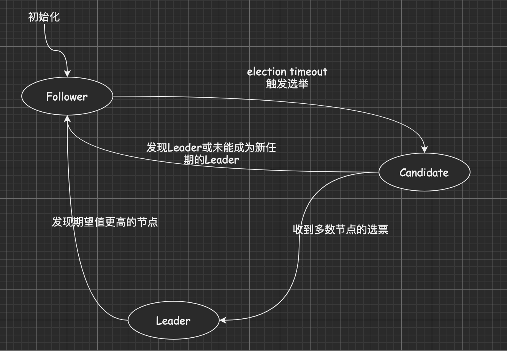
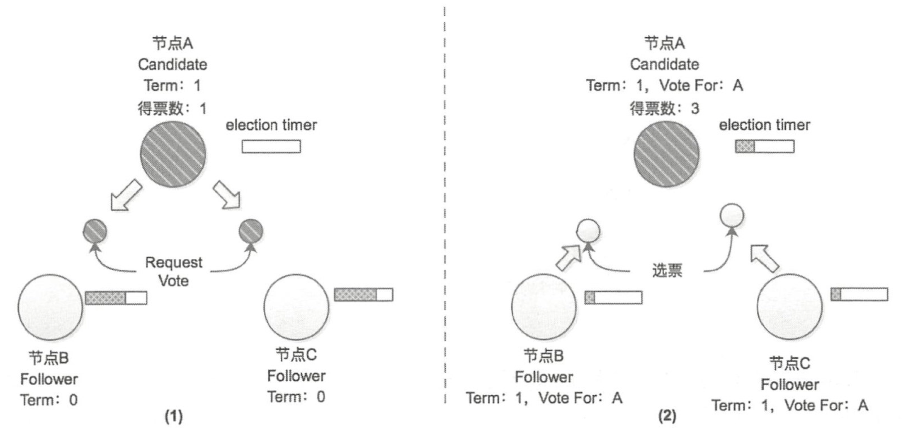
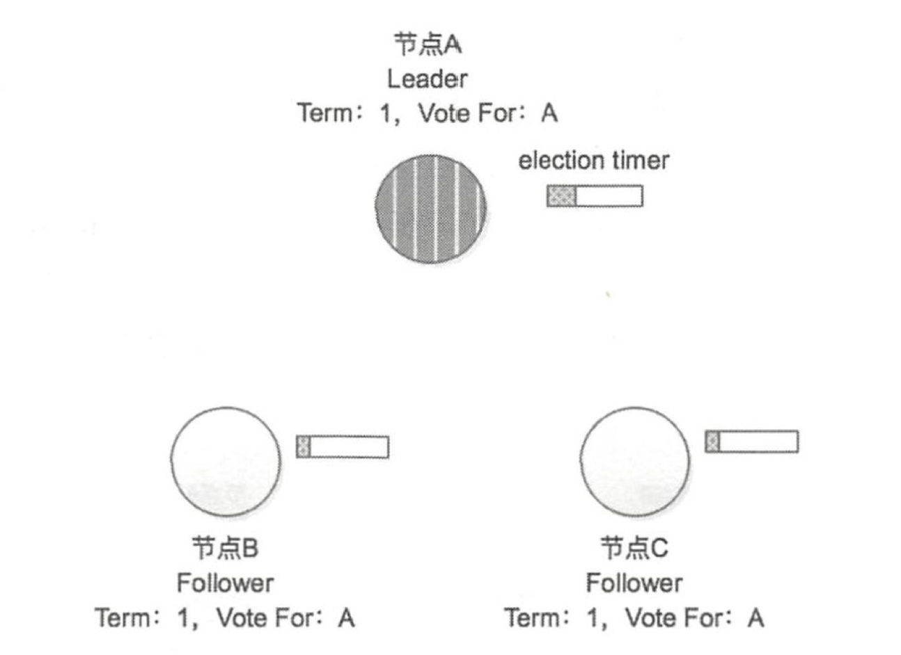

## `Leader`选举
每个`etcd`的节点内含一个状态机，状态机如下：

从上图可以看出节点有以下状态：
* **Leader**. `Leader`节点处理所有客户端的请求，当收到写入请求时，在本地追加一条日志。并将这条修改，以消息的形式发送出去。当超过半数`Follower`都收到给节点的时候标记为`commited`,可以向客户端返回响应。
* **Follower**. 不处理任何请求，被动的接收`Leader`或`Candidate`的请求。
* **Candidate**. 当`Follower`长时间没有收到`Leader`的心跳时，其选举计时器将过期，自身状态转为`Candidate`, 发起新一轮选举。

在初始启动时，节点都为`Follower`, 在选举计时器超时后，节点状态变为`Candidate`，准备发起选举。
在选举中，每个`Candidate`都有自己的任期(`Term`, 全局的连续递增的整数，每进行一次选举任期`+1`)。
每个节点都会记录当前的任期值(`currentTerm`).
### 选举过程

各`Follower`节点的`currTerm`小于请求投票节点的`currTerm`则将票投出。
同时`Follower`节点记录当前的`currTerm`和`Vote for`.
### 日志复制

